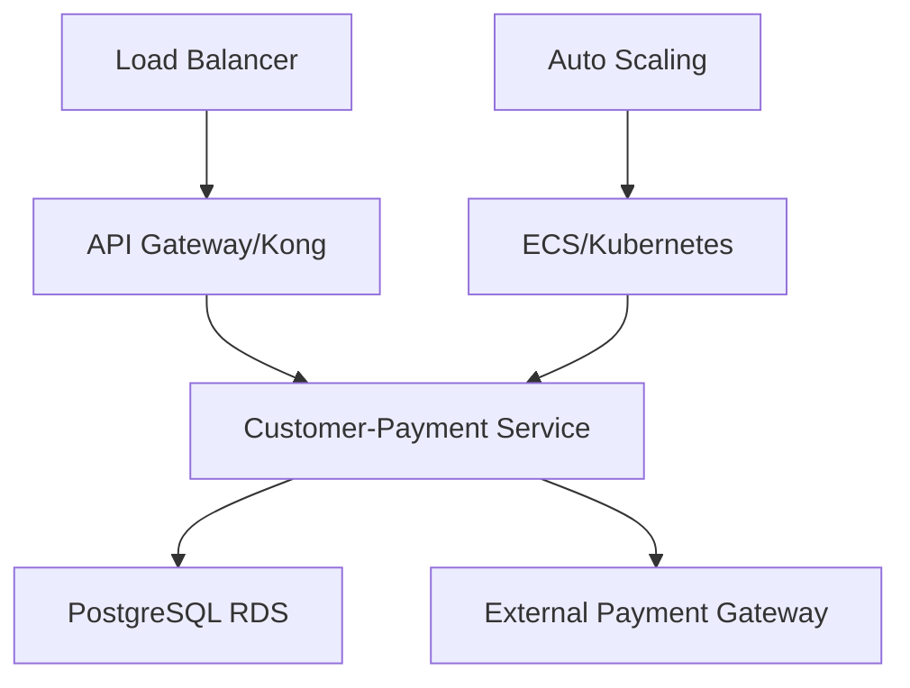

# Microservice Customer-Payment

[](https://sonarcloud.io/summary/new_code?id=fiap-tech-challange_microservice-customer-payment)
[](https://sonarcloud.io/summary/new_code?id=fiap-tech-challange_microservice-customer-payment)

## 📋 Overview

Microservice responsible for **customer management** and **payment processing** built with **Clean Architecture** and **NestJS**. This service is part of the Tech Challenge microservices architecture and handles all domain logic related to customers and payment processing.

## 🚀 Features

### 👥 Customer Management

- Customer registration with CPF, name, email and phone
- Customer identification by CPF or ID
- Validation using Value Objects (CPF, Email)
- Paginated customer listing

### 💳 Payment Management

- Payment transaction creation
- Payment status tracking (pending, approved, cancelled)
- Webhook support for external payment gateways
- Payment query by ID

## 📊 Quality Metrics

- **Coverage**: 88.14% (131 tests, 10 suites)
- **Quality**: Integrated with SonarCloud
- **CI/CD**: Automated pipeline with GitHub Actions
- **Architecture**: Clean Architecture with isolated domains

## 🏗️ Architecture

### Technology Stack

- **Framework**: NestJS 10+ with TypeScript 5.9.3
- **Architecture**: Clean Architecture (Hexagonal)
- **Database**: PostgreSQL with TypeORM
- **Container**: Docker
- **Orchestration**: AWS ECS / Terraform
- **Tests**: Jest (88.14% coverage)
- **Quality**: SonarCloud + ESLint
- **CI/CD**: GitHub Actions
- **API Gateway**: Kong Gateway (separate infrastructure)

### Architecture Diagram



**Infrastructure Components:**

- **Container Orchestration**: AWS ECS with Fargate
- **Database**: PostgreSQL (RDS)
- **Auto Scaling**: CPU/Memory based
- **Load Balancer**: Application Load Balancer (ALB)
- **API Gateway**: Kong Gateway for routing
- **CI/CD**: GitHub Actions with automated deployment
- **Monitoring**: SonarCloud + CloudWatch

### Domain Separation

#### 👥 Customer Domain

- Customer registration and identification
- Data validation (CPF, Email, Phone) using Value Objects
- Queries by CPF, ID or paginated listing
- Operation history tracking

#### 💳 Payment Domain

- Payment transaction processing
- States: Pending, Approved, Cancelled
- Webhook integration with external gateways
- Real-time status tracking

## 📚 API Documentation

### 👥 Customer Endpoints

```http
POST   /v1/customers            # Create customer
GET    /v1/customers            # List customers (paginated)
GET    /v1/customers/{id}       # Get by ID
GET    /v1/customers/cpf/{cpf}  # Get by CPF
```

**Request Example (POST /v1/customers)**:

```json
{
  "cpf": "12345678900",
  "name": "João Silva",
  "email": "joao@example.com",
  "phone": "11999999999"
}
```

### 💳 Payment Endpoints

```http
POST   /v1/payment              # Create payment
GET    /v1/payment/{id}         # Get payment
PATCH  /v1/payment/{id}/approve # Approve payment (webhook)
PATCH  /v1/payment/{id}/cancel  # Cancel payment (webhook)
```

**Request Example (POST /v1/payment)**:

```json
{
  "orderId": "uuid-order-id",
  "amount": 45.9,
  "paymentMethod": "credit_card"
}
```

**Payment States**:

- `pending`: Awaiting confirmation
- `approved`: Payment confirmed
- `cancelled`: Payment cancelled

### 🔐 Authentication

Webhook endpoints require authentication via:

- **`external-payment-consumer-key`**: API key for external payment webhooks

Management endpoints may require JWT as per API Gateway integration.

## 🚀 Getting Started

### Prerequisites

- **Docker** (v20+) and **Docker Compose**
- **Node.js** (v20-22) for local development
- **PostgreSQL** (v14+)

### Local Execution with Docker

#### 1. Environment Setup

```bash
# Navigate to app folder
cd microservice-customer/app

# Configure environment variables
cp env-example .env
# Adjust variables in .env file as needed
```

**Main Environment Variables:**

```bash
# Database
DB_HOST=localhost
DB_PORT=5432
DB_USERNAME=postgres
DB_PASSWORD=postgres
DB_DATABASE=customer_payment

# Application
PORT=3000
NODE_ENV=development

# Payment Gateway (optional for local)
PAYMENT_GATEWAY_URL=http://localhost:3001
PAYMENT_GATEWAY_API_KEY=your-key
```

#### 2. Service Initialization

```bash
# Start all services (app + database)
docker-compose up -d

# Check logs
docker-compose logs -f app

# Check container status
docker-compose ps
```

#### 3. Application Access

- **API**: [http://localhost:3000](http://localhost:3000)
- **Health Check**: [http://localhost:3000/health](http://localhost:3000/health)

### Local Development (without Docker)

```bash
# Install dependencies
npm install

# Run migrations
npm run typeorm:migration:run

# Start in development mode
npm run start:dev
```

## 🛠️ Development Commands

### Installation

```bash
npm install
```

### Execution

```bash
# Development with hot-reload
npm run start:dev

# Debug mode
npm run start:debug

# Production
npm run build && npm run start:prod
```

### Tests

```bash
# Unit tests
npm test

# Tests with coverage
npm run test:cov

# Tests in watch mode
npm run test:watch

# Debug tests
npm run test:debug
```

### Database

```bash
# Generate migration
npm run typeorm:migration:generate -- src/migrations/MigrationName

# Run migrations
npm run typeorm:migration:run

# Revert migration
npm run typeorm:migration:revert
```

### Code Quality

```bash
# Lint with auto-fix
npm run lint

# Code formatting
npm run format
```

## 🏗️ Clean Architecture Structure

```
app/src/
├── common/                    # Shared elements between layers
│   ├── DTOs/                 # Common Data Transfer Objects
│   ├── dataSource/           # Data access interfaces
│   └── exceptions/           # Custom system exceptions
├── core/                     # 🎯 INNER LAYER - Business Rules
│   ├── common/              # Utilities and Value Objects (CPF, Email, etc.)
│   └── modules/             # Domain modules
│       ├── customer/        # Customer domain
│       │   ├── DTOs/        # Input/output contracts
│       │   ├── controllers/ # Use case orchestration
│       │   ├── entities/    # Domain entities
│       │   ├── gateways/    # Data access interfaces
│       │   ├── mappers/     # DTO/Entity mapping
│       │   ├── presenters/  # Response formatting
│       │   └── useCases/    # Business rules (use cases)
│       └── payment/         # Payment domain
│           └── ...          # Same structure as customer
└── external/                # 🌐 OUTER LAYER - Implementation Details
    ├── consumers/           # External interfaces (NestJS API)
    └── dataSources/         # Data access implementations
```

### Applied Principles

- **🔄 Dependency Inversion**: Core doesn't depend on external details
- **🧪 Testability**: Isolated and testable business rules
- **🔌 Framework Independence**: Business logic decoupled from NestJS
- **📱 UI Independence**: API can be consumed by any interface
- **🗄️ Database Independence**: Using interfaces for persistence

## 🧪 Testing

### Coverage and Quality

- **Total Coverage**: 88.14%
- **Test Suites**: 10 (all passing)
- **Total Tests**: 131 (all passing)
- **Domain Focus**: Customer and Payment domains only

**Test Types:**

- ✅ Unit Tests: Business rules coverage (entities, use cases)
- ✅ Integration Tests: Controllers and repositories validation
- ✅ Value Objects Tests: CPF, Email, etc. validation
- ✅ Configured Mocks: External dependency simulation

### Test Structure

```
app/test/
├── jest.setup.ts              # Global test configuration
└── core/
    ├── mock/                  # Centralized mocks
    └── modules/
        ├── customer/          # Customer module tests
        └── payment/           # Payment module tests
```

## 🔄 CI/CD Pipeline

### GitHub Actions Workflows

#### 1. CI Workflow (.github/workflows/ci.yml)

**Triggers**:

- Pull requests to `main` and `develop`
- Push to `main` and `develop`

**Jobs**:

1. **test**: Run all tests with coverage
2. **sonarqube**: Quality analysis (needs: test)

**Features**:

- ✅ Node.js 20.x
- ✅ Automated tests
- ✅ Coverage report
- ✅ SonarCloud integration
- ✅ Quality gate validation

#### 2. Deploy Workflow (.github/workflows/app.yml)

**Triggers**:

- Workflow run (waits for CI to pass)
- Push to `main` with paths: `app/**`, `infra/ecs/**`
- Manual dispatch

**Features**:

- ✅ Waits for CI success
- ✅ AWS ECS deployment
- ✅ Terraform infrastructure update
- ✅ Auto rollback on failure

## ☸️ Deployment

### Terraform Deploy

The microservice has infrastructure as code with Terraform for AWS deployment:

```bash
cd infra/ecs

# Initialize Terraform
terraform init

# Plan deployment
terraform plan

# Apply infrastructure
terraform apply
```

**Created Components**:

- ECS Task Definition and Service
- PostgreSQL RDS
- Security Groups
- IAM Roles
- CloudWatch Logs

For more details see [infra/ecs/README.md](./infra/ecs/README.md)

### Database Infrastructure

The microservice includes database infrastructure setup:

```bash
cd infra/database

# Deploy database infrastructure
terraform init
terraform apply
```

For more details see [infra/database/README.md](./infra/database/README.md)

## 📊 Monitoring and Observability

### SonarCloud

- **Project**: fiap-tech-challange_microservice-customer-payment
- **Organization**: fiap-tech-challange
- **Quality Gate**: Coverage > 80%, No bugs, No vulnerabilities

### CloudWatch (AWS)

- **Logs**: ECS task logs
- **Metrics**: CPU, Memory, Request count
- **Alarms**: Auto-scaling triggers

## 🔗 Related Repositories

- **API Gateway**: [infra-gw-terraform](../infra-gw-terraform/)
- **Products Service**: [microservice-products](../microservice-products/)
- **Store Service**: [microservice-store](../microservice-store/)
- **Notification Service**: [microservice-notification](../microservice-notification/)

## 📝 License

This project is part of the FIAP Tech Challenge program.
