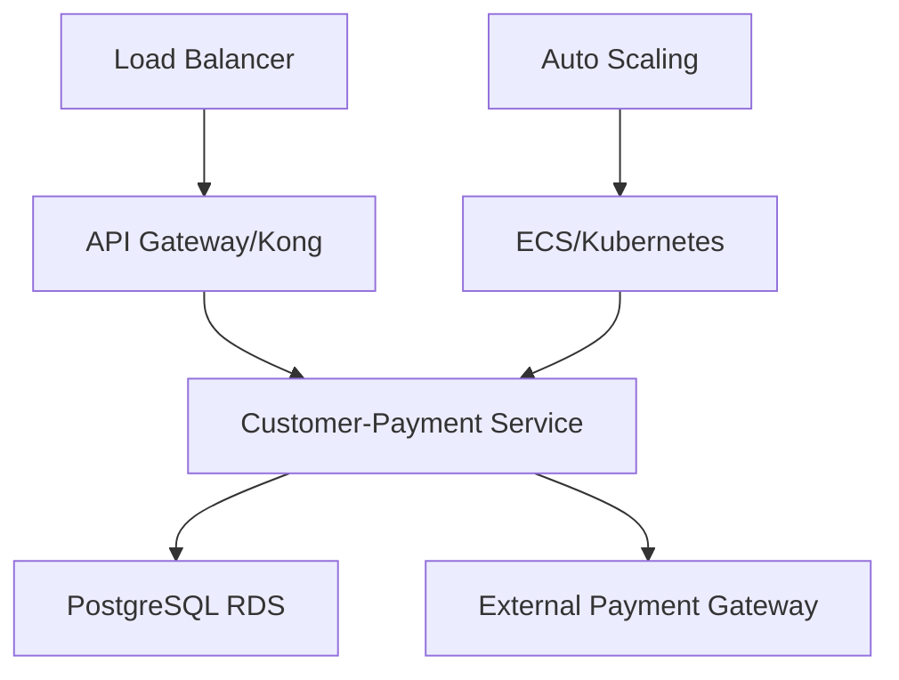

# Microservice Customer-Payment

## 📋 Visão Geral

Microserviço responsável pela **gestão de clientes** e **processamento de pagamentos** construído com **Clean Architecture** e **NestJS**. Este serviço faz parte da arquitetura de microserviços do Tech Challenge e gerencia toda a lógica de domínio relacionada a clientes e processamento de pagamentos.

## 🚀 Funcionalidades

### 👥 Gestão de Clientes

- Cadastro de clientes com CPF, nome, email e telefone
- Identificação de clientes por CPF ou ID
- Validação através de Value Objects (CPF, Email)
- Listagem paginada de clientes

### 💳 Gestão de Pagamentos

- Criação de transações de pagamento
- Rastreamento de status de pagamento (pendente, aprovado, cancelado)
- Suporte a webhooks para gateways de pagamento externos
- Consulta de pagamento por ID

## 📊 Métricas de Qualidade

- **Cobertura**: 88.14% (131 testes, 10 suites)
- **Qualidade**: Integrado com SonarCloud
- **CI/CD**: Pipeline automatizado com GitHub Actions
- **Arquitetura**: Clean Architecture com domínios isolados

## 🏗️ Arquitetura

### Stack Tecnológico

- **Framework**: NestJS 10+ com TypeScript 5.9.3
- **Arquitetura**: Clean Architecture (Hexagonal)
- **Banco de Dados**: PostgreSQL com TypeORM
- **Container**: Docker
- **Orquestração**: AWS ECS / Terraform
- **Testes**: Jest (88.14% de cobertura)
- **Qualidade**: SonarCloud + ESLint
- **CI/CD**: GitHub Actions
- **API Gateway**: Kong Gateway (infraestrutura separada)

### Diagrama de Arquitetura



**Componentes de Infraestrutura:**

- **Orquestração de Containers**: AWS ECS com Fargate
- **Banco de Dados**: PostgreSQL (RDS)
- **Auto Scaling**: Baseado em CPU/Memória
- **Load Balancer**: Application Load Balancer (ALB)
- **API Gateway**: Kong Gateway para roteamento
- **CI/CD**: GitHub Actions com deployment automatizado
- **Monitoramento**: SonarCloud + CloudWatch

### Separação de Domínios

#### 👥 Domínio de Clientes

- Cadastro e identificação de clientes
- Validação de dados (CPF, Email, Telefone) usando Value Objects
- Consultas por CPF, ID ou listagem paginada
- Rastreamento de histórico de operações

#### 💳 Domínio de Pagamentos

- Processamento de transações de pagamento
- Estados: Pendente, Aprovado, Cancelado
- Integração via webhook com gateways externos
- Rastreamento de status em tempo real

## 📚 Documentação da API

### 👥 Endpoints de Clientes

```http
POST   /v1/customers            # Criar cliente
GET    /v1/customers            # Listar clientes (paginado)
GET    /v1/customers/{id}       # Buscar por ID
GET    /v1/customers/cpf/{cpf}  # Buscar por CPF
```

**Exemplo de Requisição (POST /v1/customers)**:

```json
{
  "cpf": "12345678900",
  "name": "João Silva",
  "email": "joao@example.com",
  "phone": "11999999999"
}
```

### 💳 Endpoints de Pagamento

```http
POST   /v1/payment              # Criar pagamento
GET    /v1/payment/{id}         # Buscar pagamento
PATCH  /v1/payment/{id}/approve # Aprovar pagamento (webhook)
PATCH  /v1/payment/{id}/cancel  # Cancelar pagamento (webhook)
```

**Exemplo de Requisição (POST /v1/payment)**:

```json
{
  "orderId": "uuid-order-id",
  "amount": 45.9,
  "paymentMethod": "credit_card"
}
```

**Estados de Pagamento**:

- `pending`: Aguardando confirmação
- `approved`: Pagamento confirmado
- `cancelled`: Pagamento cancelado

### 🔐 Autenticação

Endpoints de webhook requerem autenticação via:

- **`external-payment-consumer-key`**: Chave de API para webhooks de pagamento externos

Endpoints de gerenciamento podem requerer JWT conforme integração do API Gateway.

## 🚀 Primeiros Passos

### Pré-requisitos

- **Docker** (v20+) e **Docker Compose**
- **Node.js** (v20-22) para desenvolvimento local
- **PostgreSQL** (v14+)

### Execução Local com Docker

#### 1. Configuração do Ambiente

```bash
# Navegar para a pasta app
cd microservice-customer/app

# Configurar variáveis de ambiente
cp env-example .env
# Ajustar variáveis no arquivo .env conforme necessário
```

**Principais Variáveis de Ambiente:**

```bash
# Banco de Dados
DB_HOST=localhost
DB_PORT=5432
DB_USERNAME=postgres
DB_PASSWORD=postgres
DB_DATABASE=customer_payment

# Aplicação
PORT=3000
NODE_ENV=development

# Gateway de Pagamento (opcional para local)
PAYMENT_GATEWAY_URL=http://localhost:3001
PAYMENT_GATEWAY_API_KEY=your-key
```

#### 2. Inicialização dos Serviços

```bash
# Iniciar todos os serviços (app + banco de dados)
docker-compose up -d

# Verificar logs
docker-compose logs -f app

# Verificar status dos containers
docker-compose ps
```

#### 3. Acesso à Aplicação

- **API**: [http://localhost:3000](http://localhost:3000)
- **Health Check**: [http://localhost:3000/health](http://localhost:3000/health)

### Desenvolvimento Local (sem Docker)

```bash
# Instalar dependências
npm install

# Executar migrations
npm run typeorm:migration:run

# Iniciar em modo de desenvolvimento
npm run start:dev
```

## 🛠️ Comandos de Desenvolvimento

### Instalação

```bash
npm install
```

### Execução

```bash
# Desenvolvimento com hot-reload
npm run start:dev

# Modo debug
npm run start:debug

# Produção
npm run build && npm run start:prod
```

### Testes

```bash
# Testes unitários
npm test

# Testes com cobertura
npm run test:cov

# Testes em modo watch
npm run test:watch

# Debug de testes
npm run test:debug
```

### Banco de Dados

```bash
# Gerar migration
npm run typeorm:migration:generate -- src/migrations/MigrationName

# Executar migrations
npm run typeorm:migration:run

# Reverter migration
npm run typeorm:migration:revert
```

### Qualidade de Código

```bash
# Lint com auto-fix
npm run lint

# Formatação de código
npm run format
```

## 🏗️ Estrutura de Clean Architecture

```
app/src/
├── common/                    # Elementos compartilhados entre camadas
│   ├── DTOs/                 # Data Transfer Objects comuns
│   ├── dataSource/           # Interfaces de acesso a dados
│   └── exceptions/           # Exceções customizadas do sistema
├── core/                     # 🎯 CAMADA INTERNA - Regras de Negócio
│   ├── common/              # Utilitários e Value Objects (CPF, Email, etc.)
│   └── modules/             # Módulos de domínio
│       ├── customer/        # Domínio de clientes
│       │   ├── DTOs/        # Contratos de entrada/saída
│       │   ├── controllers/ # Orquestração dos casos de uso
│       │   ├── entities/    # Entidades de domínio
│       │   ├── gateways/    # Interfaces de acesso a dados
│       │   ├── mappers/     # Mapeamento DTO/Entidade
│       │   ├── presenters/  # Formatação de respostas
│       │   └── useCases/    # Regras de negócio (casos de uso)
│       └── payment/         # Domínio de pagamentos
│           └── ...          # Mesma estrutura de customer
└── external/                # 🌐 CAMADA EXTERNA - Detalhes de Implementação
    ├── consumers/           # Interfaces externas (API NestJS)
    └── dataSources/         # Implementações de acesso a dados
```

### Princípios Aplicados

- **🔄 Inversão de Dependência**: Core não depende de detalhes externos
- **🧪 Testabilidade**: Regras de negócio isoladas e testáveis
- **🔌 Independência de Framework**: Lógica de negócio desacoplada do NestJS
- **📱 Independência de UI**: API pode ser consumida por qualquer interface
- **🗄️ Independência de Banco de Dados**: Uso de interfaces para persistência

## 🧪 Testes

### Cobertura e Qualidade

- **Cobertura Total**: 88.14%
- **Suites de Teste**: 10 (todas passando)
- **Total de Testes**: 131 (todos passando)
- **Foco de Domínio**: Domínios de Cliente e Pagamento apenas

**Tipos de Teste:**

- ✅ Testes Unitários: Cobertura de regras de negócio (entidades, casos de uso)
- ✅ Testes de Integração: Validação de controllers e repositórios
- ✅ Testes de Value Objects: Validação de CPF, Email, etc.
- ✅ Mocks Configurados: Simulação de dependências externas

### Estrutura de Testes

```
app/test/
├── jest.setup.ts              # Configuração global de testes
└── core/
    ├── mock/                  # Mocks centralizados
    └── modules/
        ├── customer/          # Testes do módulo de clientes
        └── payment/           # Testes do módulo de pagamentos
```

## 🔄 Pipeline de CI/CD

### Workflows do GitHub Actions

#### 1. Workflow de CI (.github/workflows/ci.yml)

**Gatilhos**:

- Pull requests para `main` e `develop`
- Push para `main` e `develop`

**Jobs**:

1. **test**: Executa todos os testes com cobertura
2. **sonarqube**: Análise de qualidade (needs: test)

**Funcionalidades**:

- ✅ Node.js 20.x
- ✅ Testes automatizados
- ✅ Relatório de cobertura
- ✅ Integração com SonarCloud
- ✅ Validação de quality gate

#### 2. Workflow de Deploy (.github/workflows/app.yml)

**Gatilhos**:

- Execução de workflow (aguarda CI passar)
- Push para `main` com caminhos: `app/**`, `infra/ecs/**`
- Despacho manual

**Funcionalidades**:

- ✅ Aguarda sucesso do CI
- ✅ Deploy no AWS ECS
- ✅ Atualização de infraestrutura Terraform
- ✅ Rollback automático em falha

## ☸️ Deploy

### Deploy com Terraform

O microserviço possui infraestrutura como código com Terraform para deploy na AWS:

```bash
cd infra/ecs

# Inicializar Terraform
terraform init

# Planejar deploy
terraform plan

# Aplicar infraestrutura
terraform apply
```

**Componentes Criados**:

- Task Definition e Service do ECS
- PostgreSQL RDS
- Security Groups
- IAM Roles
- CloudWatch Logs

Para mais detalhes veja [infra/ecs/README.md](./infra/ecs/README.md)

### Infraestrutura de Banco de Dados

O microserviço inclui configuração de infraestrutura de banco de dados:

```bash
cd infra/database

# Deploy da infraestrutura de banco de dados
terraform init
terraform apply
```

Para mais detalhes veja [infra/database/README.md](./infra/database/README.md)

## 📊 Monitoramento e Observabilidade

### SonarCloud

- **Projeto**: fiap-tech-challange_microservice-customer-payment
- **Organização**: fiap-tech-challange
- **Quality Gate**: Cobertura > 80%, Sem bugs, Sem vulnerabilidades

### CloudWatch (AWS)

- **Logs**: Logs de tarefas do ECS
- **Métricas**: CPU, Memória, Contagem de requisições
- **Alarmes**: Gatilhos de auto-scaling

## 🔗 Repositórios Relacionados

- **API Gateway**: [infra-gw-terraform](../infra-gw-terraform/)
- **Serviço de Produtos**: [microservice-products](../microservice-products/)
- **Serviço de Loja**: [microservice-store](../microservice-store/)
- **Serviço de Notificações**: [microservice-notification](../microservice-notification/)
