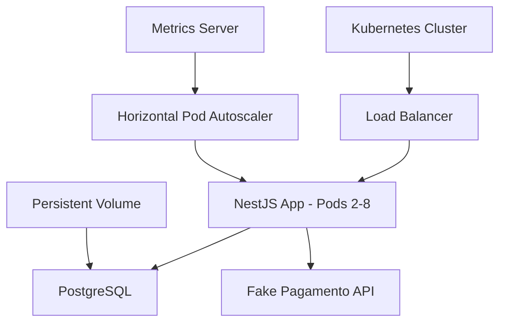

# Tech Challenge - Sistema de Autoatendimento

[](https://github.com/davidasteixeira/tech-challenge/actions/workflows/ci.yml)

## 📋 Visão Geral

Sistema de autoatendimento para lanchonetes desenvolvido com **Clean Architecture** e **NestJS**. A solução permite o gerenciamento completo do fluxo de pedidos através de totens de autoatendimento, desde a seleção de produtos até o pagamento e acompanhamento do status do pedido.

### 🚀 Principais Funcionalidades

- **🏪 Gestão de Lojas**: Cadastro e autenticação de estabelecimentos
- **🖥️ Totens de Autoatendimento**: Gerenciamento de pontos de venda
- **👥 Clientes**: Cadastro opcional com CPF para identificação
- **📦 Produtos e Categorias**: Catálogo organizado por categorias
- **🛒 Pedidos**: Fluxo completo do pedido com rastreamento de status
- **💳 Pagamentos**: Simulador fake de pagamentos
- **📊 Dashboard**: Acompanhamento de pedidos em tempo real
- **☁️ Deploy Kubernetes**: Infraestrutura escalável e resiliente

## 🏗️ Arquitetura do Sistema

### Desenho da Arquitetura

A solução foi projetada seguindo os princípios de **Clean Architecture** para atender aos seguintes requisitos:

#### 📋 Requisitos de Negócio

- **Autoatendimento**: Sistema para pedidos sem necessidade de atendente
- **Gestão de Filas**: Controle inteligente de pedidos por status e prioridade
- **Pagamentos Seguros**: Integração e fallback simulado
- **Escalabilidade**: Suporte a múltiplas lojas e totens
- **Rastreabilidade**: Acompanhamento completo do ciclo do pedido

#### ⚙️ Requisitos de Infraestrutura



**Componentes da Infraestrutura:**

- **Kubernetes**: Orquestração de containers (MicroK8s/AKS/EKS/GKE)
- **Auto Scaling**: HPA configurado para 2-8 pods baseado em CPU/Memória
- **Load Balancer**: Distribuição de carga entre pods
- **Persistent Storage**: Volume persistente para PostgreSQL
- **Health Checks**: Monitoramento contínuo da aplicação
- **CI/CD**: Pipeline automatizado com GitHub Actions

### 🔧 Stack Tecnológica

- **Backend**: NestJS + TypeScript + Clean Architecture
- **Banco de Dados**: PostgreSQL com TypeORM
- **Container**: Docker + Kubernetes
- **Pagamentos**: Simulador Fake
- **Testes**: Jest + Supertest
- **Documentação**: Swagger/OpenAPI

## 📚 Documentação da API

### 🔗 Swagger Documentation

A documentação completa da API está disponível através do Swagger:

**🌐 URL Local**: [http://localhost:3000/docs](http://localhost:3000/docs)

**📄 Collection JSON**: [swagger-docs.json](./swagger-docs.json)

### 🔑 Endpoints Principais

#### 🏪 **Autenticação e Lojas**

```http
POST /v1/auth/login           # Login da loja
POST /v1/stores               # Cadastro de nova loja
GET  /v1/stores               # Dados da loja autenticada
POST /v1/stores/totems        # Criar totem
DELETE /v1/stores/totems/{id} # Remover totem
```

#### 👥 **Clientes**

```http
POST /v1/customers            # Cadastrar cliente
GET  /v1/customers            # Listar clientes (paginado)
GET  /v1/customers/{id}       # Buscar por ID
GET  /v1/customers/cpf/{cpf}  # Buscar por CPF
```

#### 📦 **Produtos e Categorias**

```http
GET  /v1/categories           # Listar categorias
POST /v1/categories           # Criar categoria
POST /v1/categories/{id}/products    # Criar produto
DELETE /v1/categories/{catId}/products/{prodId} # Remover produto
```

#### 🛒 **Pedidos**

```http
POST /v1/order                # Criar pedido
GET  /v1/order/all            # Listar pedidos (paginado)
GET  /v1/order/sorted-list    # Lista ordenada por status
GET  /v1/order/{id}           # Buscar pedido
PATCH /v1/order/{id}/prepare  # Marcar como "Em Preparo"
PATCH /v1/order/{id}/ready    # Marcar como "Pronto"
PATCH /v1/order/{id}/finished # Marcar como "Finalizado"
```

#### 💳 **Pagamentos**

```http
POST /v1/payment              # Criar pagamento
GET  /v1/payment/{id}         # Consultar pagamento
PATCH /v1/payment/{id}/approve # Aprovar pagamento (webhook)
PATCH /v1/payment/{id}/cancel  # Cancelar pagamento (webhook)
```

### 🔐 Autenticação

A API utiliza múltiplos esquemas de autenticação:

- **`access-token`**: JWT Bearer para lojas autenticadas
- **`totem-token`**: Token específico para totems
- **`api-key`**: Chave de API para endpoints públicos
- **`external-payment-consumer-key`**: Chave para webhooks de pagamento

## 🚀 Guia Completo de Execução

### 📋 Pré-requisitos

- **Docker** (v20+) e **Docker Compose** (v2+)
- **Node.js** (v18+) para desenvolvimento local
- **Kubernetes** (MicroK8s/Kind/AKS/EKS/GKE) para deploy em produção

### 🐳 Execução Local com Docker

#### 1. **Configuração do Ambiente**

```bash
# Clone o repositório
git clone https://github.com/davidasteixeira/tech-challenge.git
cd tech-challenge

# Configure as variáveis de ambiente
cp env-example .env
# Ajuste as variáveis no arquivo .env conforme necessário
```

Ajuste as variáveis conforme necessário no arquivo `.env` criado.

#### 2. **Inicialização dos Serviços**

```bash
# Inicie todos os serviços
docker-compose up -d

# Verifique os logs
docker-compose logs -f

# Verifique o status dos containers
docker-compose ps
```

#### 3. **Acesso à Aplicação**

- **API**: [http://localhost:3000](http://localhost:3000)
- **Swagger**: [http://localhost:3000/docs](http://localhost:3000/docs)
- **Health Check**: [http://localhost:3000/health](http://localhost:3000/health)

### ☸️ Deploy Kubernetes

Para deploy completo em Kubernetes, consulte a documentação específica:

**📖 [Documentação Kubernetes](./k8s/README.md)**

A documentação do Kubernetes inclui:

- Configuração de todos os artefatos (Namespace, Secrets, Deployments, Services, HPA)
- Scripts de automação para deploy e limpeza
- Guia de troubleshooting e monitoramento
- Configuração de testes de carga com K6

### 🔄 Ordem de Execução das APIs

#### **Fluxo Básico de Operação:**

1. **📝 Cadastro da Loja**

```bash
POST /v1/stores
# Cadastrar dados da loja (CNPJ, email, senha, etc.)
```

2. **🔑 Autenticação**

```bash
POST /v1/auth/login
# Fazer login para obter o access_token JWT
```

3. **🖥️ Configuração de Totems**

```bash
POST /v1/stores/totems
# Criar totems de autoatendimento
```

4. **📦 Configuração do Catálogo**

```bash
POST /v1/categories        # Criar categorias
POST /v1/categories/{id}/products  # Adicionar produtos
```

5. **👤 Fluxo do Cliente (Opcional)**

```bash
POST /v1/customers         # Cadastrar cliente (opcional)
GET /v1/customers/cpf/{cpf} # Buscar cliente por CPF
```

6. **🛒 Processo de Pedido**

```bash
POST /v1/order             # Criar pedido
PATCH /v1/order/{id}/customer # Vincular cliente (opcional)
POST /v1/payment           # Gerar pagamento
```

7. **📊 Gestão de Pedidos**

```bash
GET /v1/order/sorted-list  # Acompanhar fila de pedidos
PATCH /v1/order/{id}/prepare # Iniciar preparo
PATCH /v1/order/{id}/ready   # Marcar como pronto
PATCH /v1/order/{id}/finished # Finalizar entrega
```

#### **Headers Necessários:**

```bash
# Para endpoints de loja
Authorization: Bearer {access_token}

# Para endpoints de totem
totem-access-token: {totem_token}

# Para cadastro inicial
x-api-key: {api_key}
```

## 🏗️ Arquitetura Clean Code

### 📁 Estrutura do Projeto

O projeto implementa **Clean Architecture** com separação clara de responsabilidades:

```
src/
├── common/                    # Elementos compartilhados entre camadas
│   ├── DTOs/                 # Data Transfer Objects comuns
│   ├── dataSource/           # Interfaces para acesso a dados
│   └── exceptions/           # Exceções customizadas do sistema
├── core/                     # 🎯 CAMADA INTERNA - Regras de Negócio
│   ├── common/              # Utilitários e Value Objects (CPF, Email, etc.)
│   └── modules/             # Módulos de domínio (customer, order, payment, etc.)
│       └── {module}/        # Cada módulo contém:
│           ├── DTOs/        # Contratos de entrada/saída
│           ├── controllers/ # Orquestração de casos de uso
│           ├── entities/    # Entidades de domínio
│           ├── gateways/    # Interfaces para acesso a dados
│           ├── mappers/     # Mapeamento entre DTOs e entidades
│           ├── presenters/  # Formatação de resposta
│           └── useCases/    # Regras de negócio (casos de uso)
└── external/                # 🌐 CAMADA EXTERNA - Detalhes de Implementação
    ├── consumers/           # Interfaces externas (NestJS API)
    └── dataSources/         # Implementações de acesso a dados
```

### 🎯 Princípios Aplicados

- **🔄 Inversão de Dependência**: Core não depende de detalhes externos
- **🧪 Testabilidade**: Regras de negócio isoladas e testáveis
- **🔌 Independência de Framework**: Lógica de negócio desacoplada do NestJS
- **📱 Independência de UI**: API pode ser consumida por qualquer interface
- **🗄️ Independência de Banco**: Uso de interfaces para persistência

### 📖 Documentação Detalhada

Para informações completas sobre a arquitetura, consulte:

**📄 [Guia de Clean Architecture](./src/CLEAN_ARCHITECTURE_GUIDE.md)**

## 🛠️ Comandos de Desenvolvimento

### 📦 Instalação

```bash
# Instalar dependências
npm install

# Configurar ambiente
cp env-example .env
```

### 🚀 Execução

```bash
# Desenvolvimento com hot-reload
npm run start:dev

# Modo debug
npm run start:debug

# Produção
npm run build && npm run start:prod
```

### 🧪 Testes

```bash
# Testes unitários
npm test

# Testes com coverage
npm run test:cov

# Testes em modo watch
npm run test:watch

# Debug de testes
npm run test:debug
```

### 🗄️ Banco de Dados

```bash
# Gerar migration
npm run typeorm:migration:generate -- src/migrations/NomeDaMigration

# Executar migrations
npm run typeorm:migration:run

# Reverter migration
npm run typeorm:migration:revert
```

### 🔍 Qualidade de Código

```bash
# Lint e correção automática
npm run lint

# Formatação de código
npm run format
```

## 🧪 Testes

### 📊 Cobertura e Qualidade

O projeto possui uma suíte abrangente de testes que garante a qualidade e confiabilidade do código:

#### **Tipos de Teste:**

- ✅ **Testes Unitários**: Cobertura das regras de negócio (entities, use cases)
- ✅ **Testes de Integração**: Validação de controllers e repositories
- ✅ **Testes de Value Objects**: Validação de CPF, Email, CNPJ, etc.
- ✅ **Mocks Configurados**: Simulação de dependências externas

#### **Comandos de Teste:**

```bash
# Executar todos os testes
npm test

# Testes com relatório de cobertura
npm run test:cov

# Testes em modo watch (desenvolvimento)
npm run test:watch

# Debug de testes específicos
npm run test:debug
```

#### **Configuração Especial:**

- **Polyfills automáticos** para crypto no ambiente CI
- **Configuração Jest** otimizada para TypeScript
- **Mocks centralizados** em `test/core/mock/`
- **Setup automatizado** com `jest.setup.ts`

### 🔧 Estrutura de Testes

```
test/
├── jest.setup.ts              # Configuração global dos testes
├── core/
│   ├── mock/                  # Mocks centralizados
│   │   ├── generalDataSource.mock.ts
│   │   ├── notificationDataSource.mock.ts
│   │   └── index.ts
│   ├── common/
│   │   └── valueObjects/      # Testes de Value Objects
│   └── modules/
│       ├── customer/          # Testes do módulo Customer
│       ├── order/             # Testes do módulo Order
│       ├── payment/           # Testes do módulo Payment
│       └── store/             # Testes do módulo Store
```

## 🔄 CI/CD

### 🚀 Pipeline Automatizado

O projeto inclui pipeline de CI/CD configurado no **GitHub Actions**:

**📄 Arquivo**: `.github/workflows/ci.yml`

#### **Características do Pipeline:**

- ✅ **Trigger**: Push e Pull Requests para `main`, `qa`, `develop`
- ✅ **Node.js Setup**: Configuração automática com cache de dependências
- ✅ **Testes Automatizados**: Execução completa da suíte de testes
- ✅ **Build Validation**: Verificação de build sem erros
- ✅ **Health Check**: Validação de endpoints críticos

#### **Matrix Strategy:**

```yaml
strategy:
  matrix:
    node-version: [18.x, 20.x]
    os: [ubuntu-latest]
```

## 🎥 Demonstração em Vídeo

### 📹 Vídeo Demonstrativo

**🔗 Link do Vídeo**: [https://www.youtube.com/watch?v=AiEWQPJ_DV4]

**📋 Conteúdo Demonstrado:**

- ✅ **Arquitetura da Solução**: Visão geral dos componentes
- ✅ **Deploy Kubernetes**: Processo de deploy e configuração
- ✅ **Funcionamento dos Endpoints**: Teste prático das APIs
- ✅ **Infraestrutura Criada**: Demonstração da stack completa
- ✅ **Fluxo de Pedido Completo**: Do cadastro à entrega
- ✅ **Monitoramento e Logs**: Observabilidade da aplicação

**🎯 Foco**: Evidência prática do funcionamento end-to-end

## 📊 Recursos Adicionais

### 🎨 Documentação Visual

- **📐 [Miro - Arquitetura e Fluxos](https://miro.com/app/board/uXjVIGlxRtY=/)**: Diagramas visuais da arquitetura e user journeys
- **🗄️ [Modelo do Banco de Dados](https://app.brmodeloweb.com/#!/publicview/68213be2acb39fc7c317bb53)**: Schema completo das entidades
- **📊 [Diagrama de Escalabilidade](.github/assets/diagram.png)**: Demonstração visual do scale e estrutura da aplicação

### 🔧 Configurações Avançadas

#### **Variáveis de Ambiente Principais:**

```bash
# Banco de Dados
DB_HOST=localhost
DB_PORT=5432
DB_USERNAME=postgres
DB_PASSWORD=postgres
DB_DATABASE=tech_challenge

# JWT
JWT_SECRET=your-secret-key
```

#### **Portas e Endpoints:**

- **Aplicação**: `3000`
- **PostgreSQL**: `5432`
- **Swagger**: `/docs`
- **Health Check**: `/health`

### 🌟 Características Técnicas

#### **Clean Architecture Benefits:**

- 🔄 **Testabilidade**: Regras de negócio isoladas
- 🔌 **Flexibilidade**: Fácil troca de frameworks/DBs
- 📈 **Escalabilidade**: Arquitetura orientada a crescimento
- 🛡️ **Manutenibilidade**: Código organizando e desacoplado

#### **Kubernetes Features:**

- 🚀 **Auto Scaling**: HPA configurado (2-8 pods)
- 💾 **Persistent Storage**: Volume para PostgreSQL
- 🔒 **Secrets Management**: Configurações sensíveis seguras
- 📊 **Health Monitoring**: Probes para disponibilidade
- ⚡ **Load Balancing**: Distribuição automática de carga

#### **Performance & Monitoring:**

- 📈 **Métricas**: CPU e memória monitoradas
- 🔍 **Logs Centralizados**: Rastreamento de eventos
- 🧪 **Testes de Carga**: K6 integrado
- 📊 **Dashboard**: Métricas em tempo real
