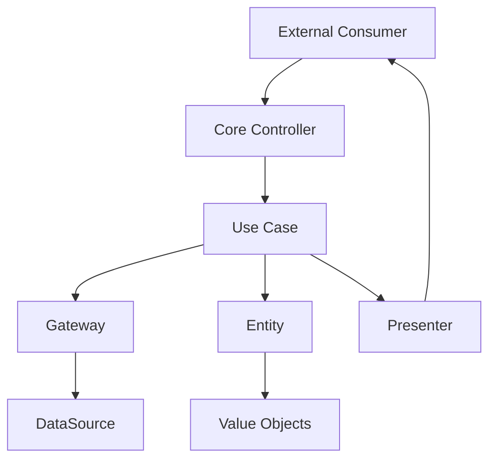

# Guia de Clean Architecture - src-clean

## 📋 Índice

1. [Visão Geral](#visão-geral)
2. [Estrutura de Pastas](#estrutura-de-pastas)
3. [Camadas da Arquitetura](#camadas-da-arquitetura)
4. [Fluxo de Comunicação](#fluxo-de-comunicação)
5. [Exemplos Práticos](#exemplos-práticos)
6. [Guia de Migração](#guia-de-migração)
7. [Padrões e Convenções](#padrões-e-convenções)

## 🎯 Visão Geral

A pasta `src-clean` implementa os princípios da **Clean Architecture** (Arquitetura Limpa). Esta arquitetura visa:

- **Independência de Frameworks**: O código de negócio não depende de frameworks específicos
- **Testabilidade**: Regras de negócio podem ser testadas sem UI, banco de dados ou web server
- **Independência de UI**: A UI pode mudar facilmente sem alterar o resto do sistema
- **Independência de Banco de Dados**: Regras de negócio não estão vinculadas ao banco
- **Inversão de Dependência**: Dependências apontam sempre para dentro (core)

## 📁 Estrutura de Pastas

```
src-clean/
├── common/                    # Elementos compartilhados entre todas as camadas
│   ├── DTOs/                 # Data Transfer Objects comuns
│   ├── dataSource/           # Interfaces e DTOs para acesso a dados
│   └── exceptions/           # Exceções customizadas do domínio
├── core/                     # Camada mais interna - Regras de Negócio
│   ├── common/              # Elementos compartilhados do core
│   │   └── valueObjects/    # Value Objects (Email, CPF, CNPJ, etc.)
│   └── modules/             # Módulos de domínio
│       └── store/           # Exemplo: módulo de loja
│           ├── DTOs/        # DTOs específicos do módulo
│           ├── controllers/ # Controllers do core (orquestração)
│           ├── entities/    # Entidades de domínio
│           ├── gateways/    # Interfaces para acesso a dados
│           ├── mappers/     # Mapeamento entre DTOs e entidades
│           ├── presenters/  # Formatação de saída
│           └── useCases/    # Casos de uso (regras de negócio)
└── external/                # Camada mais externa - Detalhes de Implementação
    ├── consumers/           # Interfaces externas (APIs, CLI, etc.)
    │   └── NestAPI/        # Implementação com NestJS
    └── dataSources/         # Implementações de acesso a dados
        ├── general/         # DataSources gerais
        └── payment/         # DataSources específicos
```

## 🏗️ Camadas da Arquitetura

### 1. 🎯 Core (Camada Interna)

#### **Entities (Entidades)**

- **Localização**: `core/modules/{module}/entities/`
- **Responsabilidade**: Representam os objetos de negócio e suas regras fundamentais
- **Características**:
  - Contêm a lógica de negócio mais crítica
  - São independentes de qualquer framework ou tecnologia
  - Validam seus próprios dados

**Exemplo**: `Store.entity.ts`

```typescript
export class Store {
  id: string;
  cnpj: CNPJ;
  name: string;
  email: Email;

  static create(props: CreateStoreProps): CoreResponse<Store> {
    // Validações e regras de negócio
  }

  validatePassword(password: string): boolean {
    // Lógica de validação de senha
  }
}
```

#### **Use Cases (Casos de Uso)**

- **Localização**: `core/modules/{module}/useCases/`
- **Responsabilidade**: Implementam regras de negócio específicas da aplicação
- **Características**:
  - Orquestram o fluxo de dados entre entidades
  - São independentes de detalhes de implementação
  - Definem o "o que" o sistema faz

**Exemplo**: `CreateStoreUseCase`

```typescript
export class CreateStoreUseCase {
  constructor(private storeGateway: StoreGateway) {}

  async execute(dto: CreateStoreInputDTO): Promise<CoreResponse<Store>> {
    // 1. Validar dados de entrada
    // 2. Verificar regras de negócio
    // 3. Criar entidade
    // 4. Persistir através do gateway
  }
}
```

#### **Gateways (Portões)**

- **Localização**: `core/modules/{module}/gateways/`
- **Responsabilidade**: Abstraem o acesso a dados externos
- **Características**:
  - Definem contratos para acesso a dados
  - Invertem a dependência (core não depende de infraestrutura)
  - Facilitam testes e mudanças de implementação

#### **Value Objects**

- **Localização**: `core/common/valueObjects/`
- **Responsabilidade**: Representam valores que são identificados por suas características
- **Exemplos**: Email, CPF, CNPJ, BrazilianPhone

### 2. 🔄 Common (Camada Compartilhada)

#### **DTOs (Data Transfer Objects)**

- **Localização**: `common/DTOs/` e `core/modules/{module}/DTOs/`
- **Responsabilidade**: Transportar dados entre camadas
- **Características**:
  - Estruturas simples de dados
  - Sem lógica de negócio
  - Facilitam a serialização/deserialização

#### **DataSource Interface**

- **Localização**: `common/dataSource/`
- **Responsabilidade**: Define contratos para acesso a dados
- **Características**:
  - Interface abstrata
  - Implementada na camada externa
  - Permite múltiplas implementações (PostgreSQL, MongoDB, InMemory, etc.)

#### **Exceptions**

- **Localização**: `common/exceptions/`
- **Responsabilidade**: Tratamento de erros do domínio
- **Tipos**:
  - `CoreException`: Exceção base
  - `ResourceInvalidException`: Dados inválidos
  - `ResourceConflictException`: Conflitos de negócio
  - `UnexpectedError`: Erros inesperados

### 3. 🌐 External (Camada Externa)

#### **Consumers**

- **Localização**: `external/consumers/`
- **Responsabilidade**: Interfaces externas que consomem o core
- **Exemplos**:
  - `NestAPI/`: API REST com NestJS
  - `CLI/`: Interface de linha de comando
  - `GraphQL/`: API GraphQL

#### **DataSources**

- **Localização**: `external/dataSources/`
- **Responsabilidade**: Implementações concretas de acesso a dados
- **Exemplos**:
  - `postgres/`: Implementação com PostgreSQL
  - `inMemory/`: Implementação em memória para testes
  - `payment/`: Integrações com gateways de pagamento

## 🔄 Fluxo de Comunicação



### Fluxo Típico:

1. **Consumer** (NestJS Controller) recebe uma requisição
2. **Core Controller** orquestra a operação
3. **Use Case** implementa a regra de negócio
4. **Gateway** abstrai o acesso aos dados
5. **DataSource** implementa o acesso real aos dados
6. **Entity** aplica validações e regras
7. **Presenter** formata a resposta
8. Resposta retorna ao **Consumer**

## 💡 Exemplos Práticos

### Exemplo: Criação de uma Loja

#### 1. DTO de Entrada

```typescript
// core/modules/store/DTOs/createStoreInput.dto.ts
export interface CreateStoreInputDTO {
  name: string;
  fantasyName: string;
  email: string;
  phone: string;
  cnpj: string;
  password: string;
}
```

#### 2. Use Case

```typescript
// core/modules/store/useCases/createStore.useCase.ts
export class CreateStoreUseCase {
  constructor(private storeGateway: StoreGateway) {}

  async execute(dto: CreateStoreInputDTO): Promise<CoreResponse<Store>> {
    // Validar e criar value objects
    const email = new Email(dto.email);
    const cnpj = new CNPJ(dto.cnpj);

    // Verificar se já existe
    const existingStore = await this.storeGateway.findStoreByEmail(dto.email);
    if (existingStore.value) {
      return {
        error: new ResourceConflictException('Store already exists'),
        value: undefined,
      };
    }

    // Criar entidade
    const { error, value: store } = Store.create({
      name: dto.name,
      email,
      cnpj,
      // ... outros campos
    });

    if (error) return { error, value: undefined };

    // Persistir
    await this.storeGateway.saveStore(store);

    return { error: undefined, value: store };
  }
}
```

#### 3. Gateway

```typescript
// core/modules/store/gateways/store.gateway.ts
export class StoreGateway {
  constructor(private dataSource: DataSource) {}

  async saveStore(store: Store): Promise<CoreResponse<void>> {
    const dto = StoreMapper.toDataSourceDTO(store);
    await this.dataSource.saveStore(dto);
    return { error: undefined, value: undefined };
  }
}
```

#### 4. Controller do Core

```typescript
// core/modules/store/controllers/store.controller.ts
export class StoreCoreController {
  constructor(private dataSource: DataSource) {}

  async createStore(dto: CreateStoreInputDTO): Promise<CoreResponse<StoreDTO>> {
    const gateway = new StoreGateway(this.dataSource);
    const useCase = new CreateStoreUseCase(gateway);

    const { error, value: store } = await useCase.execute(dto);

    if (error) return { error, value: undefined };

    const presenter = new StorePresenter();
    const storeDTO = presenter.present(store);

    return { error: undefined, value: storeDTO };
  }
}
```

## 🚀 Guia de Migração

### Passos para Migrar da `src` para `src-clean`:

#### 1. **Identificar Entidades de Domínio**

- Analise os modelos na pasta `src/modules/*/models/`
- Extraia a lógica de negócio para entidades
- Crie value objects para tipos complexos

#### 2. **Extrair Casos de Uso**

- Identifique a lógica nos services atuais
- Crie use cases específicos para cada operação
- Remova dependências de framework dos use cases

#### 3. **Criar Gateways**

- Abstraia o acesso a dados dos repositories
- Defina interfaces para persistência
- Implemente inversão de dependência

#### 4. **Implementar DataSources**

- Mova a lógica de acesso a dados para dataSources
- Mantenha compatibilidade com o TypeORM atual
- Prepare para futuras mudanças de tecnologia

#### 5. **Refatorar Controllers**

- Simplifique os controllers do NestJS
- Delegue lógica para o core controller
- Mantenha apenas responsabilidades de HTTP

### Exemplo de Migração - Customer:

#### Antes (src/modules/customers/):

```
customers/
├── customers.module.ts
├── adapters/
│   ├── customers.repository.ts
│   └── customers.controller.ts
├── models/
│   └── customer.entity.ts
├── services/
│   └── customers.service.ts
└── ports/
    └── customers.port.ts
```

#### Depois (src-clean/core/modules/customer/):

```
customer/
├── DTOs/
│   ├── createCustomerInput.dto.ts
│   ├── customer.dto.ts
│   └── updateCustomerInput.dto.ts
├── controllers/
│   └── customer.controller.ts
├── entities/
│   └── customer.entity.ts
├── gateways/
│   └── customer.gateway.ts
├── mappers/
│   └── customer.mapper.ts
├── presenters/
│   └── customer.presenter.ts
└── useCases/
    ├── createCustomer.useCase.ts
    ├── findCustomer.useCase.ts
    └── updateCustomer.useCase.ts
```

## 📝 Padrões e Convenções

### 1. **Nomenclatura**

- Entities: `{Name}.entity.ts`
- Use Cases: `{action}{Entity}.useCase.ts`
- DTOs: `{name}{Input|Output}.dto.ts`
- Gateways: `{entity}.gateway.ts`
- Value Objects: `{name}.vo.ts`

### 2. **Estrutura de Resposta**

```typescript
interface CoreResponse<T> {
  error: CoreException | undefined;
  value: T | undefined;
}
```

### 3. **Tratamento de Erros**

- Use o padrão Either (error/value)
- Nunca lance exceções, sempre retorne no CoreResponse
- Categorize erros por tipo (Invalid, Conflict, NotFound, etc.)

### 4. **Dependências**

- Core nunca importa de External
- External pode importar de Core e Common
- Common é compartilhado entre todas as camadas

### 5. **Testes**

- Teste entities isoladamente
- Mock gateways nos testes de use cases
- Use implementações in-memory para testes de integração

## 🎓 Benefícios da Migração

### ✅ **Vantagens:**

- **Testabilidade**: Regras de negócio podem ser testadas isoladamente
- **Manutenibilidade**: Código organizado e com responsabilidades claras
- **Flexibilidade**: Fácil mudança de tecnologias (DB, Framework, etc.)
- **Reutilização**: Core pode ser usado em diferentes interfaces
- **Evolução**: Facilita a adição de novas funcionalidades

### 📊 **Comparação:**

| Aspecto              | src (atual) | src-clean |
| -------------------- | ----------- | --------- |
| Acoplamento          | Alto        | Baixo     |
| Testabilidade        | Difícil     | Fácil     |
| Mudança de Framework | Complexa    | Simples   |
| Reutilização         | Limitada    | Alta      |
| Manutenibilidade     | Média       | Alta      |

## 🔗 Próximos Passos

1. **Comece com um módulo simples** (ex: Store)
2. **Implemente os testes** para garantir compatibilidade
3. **Migre gradualmente** outros módulos
4. **Mantenha ambas as estruturas** durante a transição
5. **Documente as decisões** arquiteturais

---

> **Nota**: Este guia serve como base para a migração gradual da arquitetura atual para Clean Architecture. A implementação deve ser feita de forma incremental, mantendo a compatibilidade com o sistema existente.
