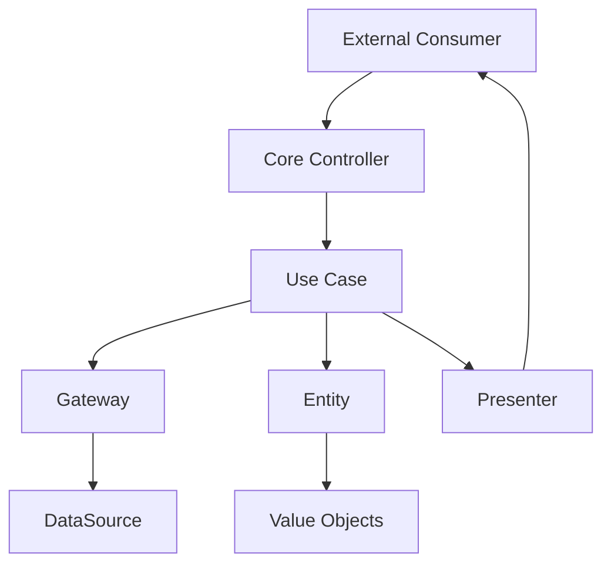

# Guia de Clean Architecture - src

## 📋 Índice

1. [Visão Geral](#visão-geral)
2. [Estrutura de Pastas](#estrutura-de-pastas)
3. [Camadas da Arquitetura](#camadas-da-arquitetura)
4. [Fluxo de Comunicação](#fluxo-de-comunicação)
5. [Exemplos Práticos](#exemplos-práticos)
6. [Arquitetura Implementada](#arquitetura-implementada)
7. [Padrões e Convenções](#padrões-e-convenções)
8. [Benefícios da Arquitetura Atual](#benefícios-da-arquitetura-atual)

## 🎯 Visão Geral

A pasta `src` implementa completamente os princípios da **Clean Architecture** (Arquitetura Limpa). Esta arquitetura oferece:

- **✅ Independência de Frameworks**: Código de negócio desacoplado do NestJS
- **✅ Testabilidade**: 190+ testes para regras de negócio isoladas
- **✅ Independência de UI**: API pode ser consumida por qualquer interface
- **✅ Independência de Banco**: Uso de interfaces para persistência
- **✅ Inversão de Dependência**: Dependências apontam para o core

**🎖️ Status**: **Totalmente Implementada e em Produção**

## 📁 Estrutura de Pastas

```
src/
├── common/                    # Elementos compartilhados entre todas as camadas
│   ├── DTOs/                 # Data Transfer Objects comuns
│   ├── dataSource/           # Interfaces e DTOs para acesso a dados
│   └── exceptions/           # Exceções customizadas do domínio
├── core/                     # Camada mais interna - Regras de Negócio
│   ├── common/              # Elementos compartilhados do core
│   │   └── valueObjects/    # Value Objects (Email, CPF, CNPJ, etc.)
│   └── modules/             # Módulos de domínio
│       └── store/           # Exemplo: módulo de loja
│           ├── DTOs/        # DTOs específicos do módulo
│           ├── controllers/ # Controllers do core (orquestração)
│           ├── entities/    # Entidades de domínio
│           ├── gateways/    # Interfaces para acesso a dados
│           ├── mappers/     # Mapeamento entre DTOs e entidades
│           ├── presenters/  # Formatação de saída
│           └── useCases/    # Casos de uso (regras de negócio)
└── external/                # Camada mais externa - Detalhes de Implementação
    ├── consumers/           # Interfaces externas (APIs, CLI, etc.)
    │   └── NestAPI/        # Implementação com NestJS
    └── dataSources/         # Implementações de acesso a dados
        ├── general/         # DataSources gerais
        └── payment/         # DataSources específicos
```

## 🏗️ Camadas da Arquitetura

### 1. 🎯 Core (Camada Interna)

#### **Entities (Entidades)**

- **Localização**: `core/modules/{module}/entities/`
- **Responsabilidade**: Representam os objetos de negócio e suas regras fundamentais
- **Características**:
  - Contêm a lógica de negócio mais crítica
  - São independentes de qualquer framework ou tecnologia
  - Validam seus próprios dados

**Exemplo**: `Store.entity.ts`

```typescript
export class Store {
  id: string;
  cnpj: CNPJ;
  name: string;
  email: Email;

  static create(props: CreateStoreProps): CoreResponse<Store> {
    // Validações e regras de negócio
  }

  validatePassword(password: string): boolean {
    // Lógica de validação de senha
  }
}
```

#### **Use Cases (Casos de Uso)**

- **Localização**: `core/modules/{module}/useCases/`
- **Responsabilidade**: Implementam regras de negócio específicas da aplicação
- **Características**:
  - Orquestram o fluxo de dados entre entidades
  - São independentes de detalhes de implementação
  - Definem o "o que" o sistema faz

**Exemplo**: `CreateStoreUseCase`

```typescript
export class CreateStoreUseCase {
  constructor(private storeGateway: StoreGateway) {}

  async execute(dto: CreateStoreInputDTO): Promise<CoreResponse<Store>> {
    // 1. Validar dados de entrada
    // 2. Verificar regras de negócio
    // 3. Criar entidade
    // 4. Persistir através do gateway
  }
}
```

#### **Gateways (Portões)**

- **Localização**: `core/modules/{module}/gateways/`
- **Responsabilidade**: Abstraem o acesso a dados externos
- **Características**:
  - Definem contratos para acesso a dados
  - Invertem a dependência (core não depende de infraestrutura)
  - Facilitam testes e mudanças de implementação

#### **Value Objects**

- **Localização**: `core/common/valueObjects/`
- **Responsabilidade**: Representam valores que são identificados por suas características
- **Exemplos**: Email, CPF, CNPJ, BrazilianPhone

### 2. 🔄 Common (Camada Compartilhada)

#### **DTOs (Data Transfer Objects)**

- **Localização**: `common/DTOs/` e `core/modules/{module}/DTOs/`
- **Responsabilidade**: Transportar dados entre camadas
- **Características**:
  - Estruturas simples de dados
  - Sem lógica de negócio
  - Facilitam a serialização/deserialização

#### **DataSource Interface**

- **Localização**: `common/dataSource/`
- **Responsabilidade**: Define contratos para acesso a dados
- **Características**:
  - Interface abstrata
  - Implementada na camada externa
  - Permite múltiplas implementações (PostgreSQL, MongoDB, InMemory, etc.)

#### **Exceptions**

- **Localização**: `common/exceptions/`
- **Responsabilidade**: Tratamento de erros do domínio
- **Tipos**:
  - `CoreException`: Exceção base
  - `ResourceInvalidException`: Dados inválidos
  - `ResourceConflictException`: Conflitos de negócio
  - `UnexpectedError`: Erros inesperados

### 3. 🌐 External (Camada Externa)

#### **Consumers**

- **Localização**: `external/consumers/`
- **Responsabilidade**: Interfaces externas que consomem o core
- **Exemplos**:
  - `NestAPI/`: API REST com NestJS
  - `CLI/`: Interface de linha de comando
  - `GraphQL/`: API GraphQL

#### **DataSources**

- **Localização**: `external/dataSources/`
- **Responsabilidade**: Implementações concretas de acesso a dados
- **Exemplos**:
  - `postgres/`: Implementação com PostgreSQL
  - `inMemory/`: Implementação em memória para testes
  - `payment/`: Integrações com gateways de pagamento

## 🔄 Fluxo de Comunicação



### Fluxo Típico:

1. **Consumer** (NestJS Controller) recebe uma requisição
2. **Core Controller** orquestra a operação
3. **Use Case** implementa a regra de negócio
4. **Gateway** abstrai o acesso aos dados
5. **DataSource** implementa o acesso real aos dados
6. **Entity** aplica validações e regras
7. **Presenter** formata a resposta
8. Resposta retorna ao **Consumer**

## 💡 Exemplos Práticos

### Exemplo: Criação de uma Loja

#### 1. DTO de Entrada

```typescript
// core/modules/store/DTOs/createStoreInput.dto.ts
export interface CreateStoreInputDTO {
  name: string;
  fantasyName: string;
  email: string;
  phone: string;
  cnpj: string;
  password: string;
}
```

#### 2. Use Case

```typescript
// core/modules/store/useCases/createStore.useCase.ts
export class CreateStoreUseCase {
  constructor(private storeGateway: StoreGateway) {}

  async execute(dto: CreateStoreInputDTO): Promise<CoreResponse<Store>> {
    // Validar e criar value objects
    const email = new Email(dto.email);
    const cnpj = new CNPJ(dto.cnpj);

    // Verificar se já existe
    const existingStore = await this.storeGateway.findStoreByEmail(dto.email);
    if (existingStore.value) {
      return {
        error: new ResourceConflictException('Store already exists'),
        value: undefined,
      };
    }

    // Criar entidade
    const { error, value: store } = Store.create({
      name: dto.name,
      email,
      cnpj,
      // ... outros campos
    });

    if (error) return { error, value: undefined };

    // Persistir
    await this.storeGateway.saveStore(store);

    return { error: undefined, value: store };
  }
}
```

#### 3. Gateway

```typescript
// core/modules/store/gateways/store.gateway.ts
export class StoreGateway {
  constructor(private dataSource: DataSource) {}

  async saveStore(store: Store): Promise<CoreResponse<void>> {
    const dto = StoreMapper.toDataSourceDTO(store);
    await this.dataSource.saveStore(dto);
    return { error: undefined, value: undefined };
  }
}
```

#### 4. Controller do Core

```typescript
// core/modules/store/controllers/store.controller.ts
export class StoreCoreController {
  constructor(private dataSource: DataSource) {}

  async createStore(dto: CreateStoreInputDTO): Promise<CoreResponse<StoreDTO>> {
    const gateway = new StoreGateway(this.dataSource);
    const useCase = new CreateStoreUseCase(gateway);

    const { error, value: store } = await useCase.execute(dto);

    if (error) return { error, value: undefined };

    const presenter = new StorePresenter();
    const storeDTO = presenter.present(store);

    return { error: undefined, value: storeDTO };
  }
}
```

## 🏁 Arquitetura Implementada

### ✅ **Clean Architecture Aplicada**

O projeto implementa completamente os princípios de Clean Architecture. Todos os módulos seguem a estrutura padronizada:

#### **Módulos Implementados:**

📦 **Módulos de Domínio** (em `src/core/modules/`):

- **customer/** - Gerenciamento de clientes
- **notification/** - Sistema de notificações
- **order/** - Gestão de pedidos
- **payment/** - Processamento de pagamentos
- **product/** - Catálogo de produtos e categorias
- **store/** - Gestão de lojas e totens

#### **Estrutura Padrão de Cada Módulo:**

```
{module}/
├── DTOs/                    # ✅ Contratos de entrada/saída
│   ├── create{Entity}Input.dto.ts
│   ├── {entity}.dto.ts
│   └── update{Entity}Input.dto.ts
├── controllers/             # ✅ Orquestração de casos de uso
│   └── {entity}.controller.ts
├── entities/                # ✅ Entidades de domínio
│   └── {entity}.entity.ts
├── gateways/               # ✅ Interfaces para acesso a dados
│   └── {entity}.gateway.ts
├── mappers/                # ✅ Mapeamento entre DTOs e entidades
│   └── {entity}.mapper.ts
├── presenters/             # ✅ Formatação de resposta
│   └── {entity}.presenter.ts
└── useCases/               # ✅ Regras de negócio (casos de uso)
    ├── create{Entity}.useCase.ts
    ├── find{Entity}ById.useCase.ts
    └── update{Entity}.useCase.ts
```

### 🎯 **Exemplo Real - Módulo Customer**

```
src/core/modules/customer/
├── DTOs/
│   ├── createCustomerInput.dto.ts    # ✅ Implementado
│   ├── customer.dto.ts               # ✅ Implementado
│   └── findCustomerInput.dto.ts      # ✅ Implementado
├── controllers/
│   └── customer.controller.ts        # ✅ Implementado
├── entities/
│   └── customer.entity.ts            # ✅ Implementado
├── gateways/
│   └── customer.gateway.ts           # ✅ Implementado
├── mappers/
│   └── customer.mapper.ts            # ✅ Implementado
├── presenters/
│   └── customer.presenter.ts         # ✅ Implementado
└── useCases/
    ├── createCustomer.useCase.ts     # ✅ Implementado
    ├── findAllCustomers.useCase.ts   # ✅ Implementado
    ├── findCustomerByCpf.useCase.ts  # ✅ Implementado
    ├── findCustomerByEmail.useCase.ts # ✅ Implementado
    └── findCustomerById.useCase.ts   # ✅ Implementado
```

## 📝 Padrões e Convenções

### 1. **Nomenclatura**

- Entities: `{Name}.entity.ts`
- Use Cases: `{action}{Entity}.useCase.ts`
- DTOs: `{name}{Input|Output}.dto.ts`
- Gateways: `{entity}.gateway.ts`
- Value Objects: `{name}.vo.ts`

### 2. **Estrutura de Resposta**

```typescript
interface CoreResponse<T> {
  error: CoreException | undefined;
  value: T | undefined;
}
```

### 3. **Tratamento de Erros**

- Use o padrão Either (error/value)
- Nunca lance exceções, sempre retorne no CoreResponse
- Categorize erros por tipo (Invalid, Conflict, NotFound, etc.)

### 4. **Dependências**

- Core nunca importa de External
- External pode importar de Core e Common
- Common é compartilhado entre todas as camadas

### 5. **Testes**

- Teste entities isoladamente
- Mock gateways nos testes de use cases
- Use implementações in-memory para testes de integração

## 🎓 Benefícios da Arquitetura Atual

### ✅ **Vantagens Implementadas:**

- **🧪 Testabilidade**: Regras de negócio testadas isoladamente (190+ testes implementados)
- **🛡️ Manutenibilidade**: Código organizado com responsabilidades claras
- **🔌 Flexibilidade**: Fácil mudança de tecnologias (DB, Framework, etc.)
- **♻️ Reutilização**: Core pode ser usado em diferentes interfaces
- **📈 Evolução**: Facilita a adição de novas funcionalidades

### 📊 **Métricas da Implementação:**

| Aspecto                 | Status Atual                                |
| ----------------------- | ------------------------------------------- |
| ✅ Acoplamento          | **Baixo - Core independente de frameworks** |
| ✅ Testabilidade        | **Alta - 190+ testes implementados**        |
| ✅ Mudança de Framework | **Simples - Core desacoplado**              |
| ✅ Reutilização         | **Alta - Múltiplos consumers possíveis**    |
| ✅ Manutenibilidade     | **Alta - Responsabilidades bem definidas**  |
| ✅ Escalabilidade       | **Alta - Deploy K8s com HPA**               |

### 🎯 **Evidências da Implementação:**

#### **� Cobertura de Testes:**

- **190+ arquivos de teste** distribuídos pela arquitetura
- **Testes unitários** para entities, use cases e value objects
- **Testes de integração** para controllers e gateways
- **Mocks centralizados** para dependências externas

#### **🔄 Inversão de Dependência:**

- Core não importa de External ✅
- Gateways abstraem acesso a dados ✅
- DataSources implementam interfaces ✅

#### **🏗️ Separação de Responsabilidades:**

- **Entities**: Regras de negócio puras ✅
- **Use Cases**: Orquestração de fluxos ✅
- **Gateways**: Contratos de dados ✅
- **DataSources**: Implementações concretas ✅
